# Dashboard
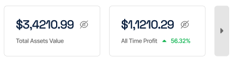

Sağa kaydırıldığı zaman 
**Total Assets Value** Kulanıcının cüzdanındaki toplam para

**All Time Profit** Kulanıcının toplam karı

**30 Days Profit** Kulanıcının 30 gün toplam karı

**7 Days Profit** Kulanıcının 7 gün toplam karı

**24 Hours Profit** Kulanıcının 24 saat toplam karı

## Transactions
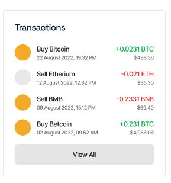

Kulanıcının son 10 işlemini gösterir. 
**View All** butonuna tıklandığında Transaction sayfasına gider.(Transactions sayfası yapılacak. Open Trades sayfasının benzeri olacak)

Coin ismi,İkon, Poziyonu Tipi**(LONG-SHORT)**, İşlem Tarihi, Kar Oranı, Pozisyona girilen tutar.

## Favorites Coins
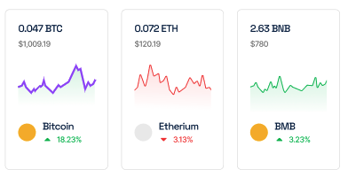

Kullanıcının favoriye aldığı coinleri gösterir. Yeni kullancılılara default olarak üç coin atar.

Coin adı, Resmi, Coinin anlık değeri, Son 24 içindeki yükseliş/düşüş oranı

## Open Trades
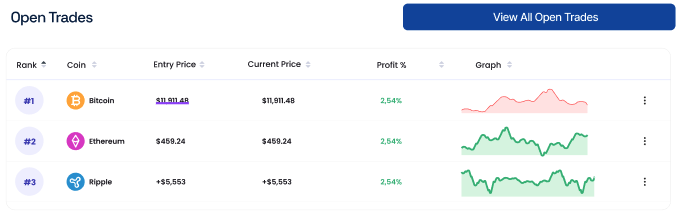

Kullanıcının işlemde olan coinlerini listeler.

Coin ikon, adı, işleme girdiği andaki fiyat, Son fiyat, kar oranı, Graph

**View All Open Trades** butonuna tıkladığı zaman Open Trades sayfasına gidecek.

# Markets
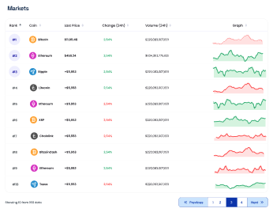

Websocket ile bilgileri Binance Futures API'dan alacak. Sadece görseldeki alanlar olacak. ***Change'de 1h-4h-24h olacak.***

# Strategies
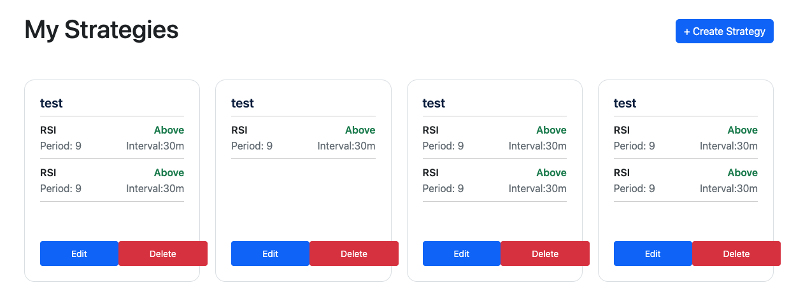

Sayfada infinity-scroll ile strategyler yüklenecek.

**Delete** butonuna basıldığı zaman popup açılacak. Mesaj olarak ***Bu stratejiyi silmek istediğinize emin misiniz?*** çıkacak. Ok ve Cancel butonları olacak. Seçime göre ilgili strateejiyi silecek veya iptal edecek.

**Edit** butonuna basıldığı zaman CreateStrategy sayfası açılacak ama inputlar dolu olarak gelecek.

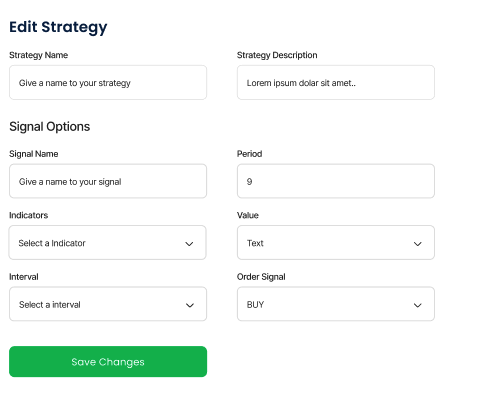

Başlıkda Edit Strategy yazacak. Altta yer alan butonda ise Save Changes yazacak.

# Create Strategy

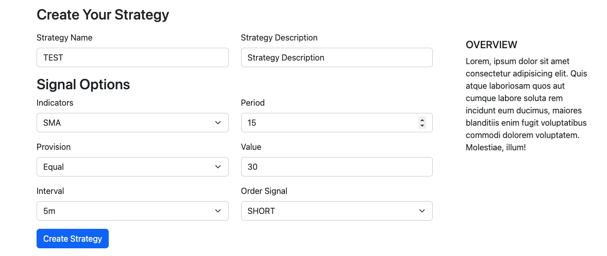

Create Strategy sayfasında Create butonuna tıklandığı zaman alert verecek. ***Stratejiniz başarılı bir şekilde oluşturuldu*** veya ***Strateji kaydedilirken bir hata oluştu. Lütfen daha sonra tekrar deneyin veya sistem yöneticisi ile iletişime geçin.***

Overview alanında girilen inputlar alt alta şekilde listelenecek.

# Bot

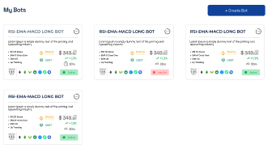

Sayfada infinity-scroll ile botlar yüklenecek.

Sağ-üst alanda yer alan butona basıldığı zaman
- Detail
- Bot aktif ise ***Passive*** değilse ***Active*** yazacak.
- Delete butonuna basıldığı zaman popup açılacak. Mesaj olarak ***Bu botu silmek istediğinize emin misiniz?*** çıkacak. Ok ve Cancel butonları olacak. Seçime göre ilgili botu silecek veya iptal edecek.

## Create Bot
Bot oluşturulduktan sonra eğer işlem başarılı ise işlem başarılı diye uyarı verilecek ve bot listesine yönlendirilecek. Eğer işlem başarısız ise aynı sayfada kalacak.

## Bot Detail
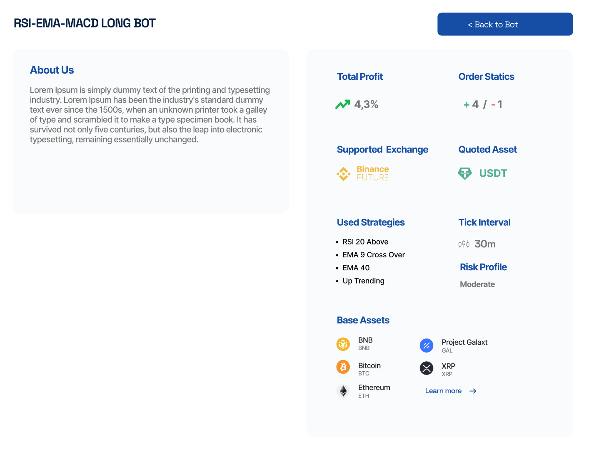
### Sol Alan
- ***RSI-EMA-MACD LONG BOT*** yazan kısım bot name olacak.
- Altındaki kutuda bot descripiton olacak.
### Sağ Alan
- Total Profit: kullanıcının botu oluşturduğu günden mevcut güne kadar olan kar/zarar oranı
- Order Statistics : bot girdiği işlemlerin kaçında kar/zarar ile pozisyon kapattı.
- Supported Exchange : Bot hangi piyasalarda kullanılabiliyor. (Şu an için sadece Binance Futures)
- Quoted Asset : Bot hangi stabil coin ile işlem yapıyor (Şu an için sadece USDT)
- Used Strategies : Botun kullandığı stratejiler
- Tick Interval : Bot hangi zaman diliminde işlem yapıyor.
- Risk Profile : Botun kar/zarar işlem sayısına göre kaybetme riski yazacak.(Bununla ilgili hesap yapacağız)
- Base Assets : Bot hangi coinlerde işlem yapıyor.

# Backtest History

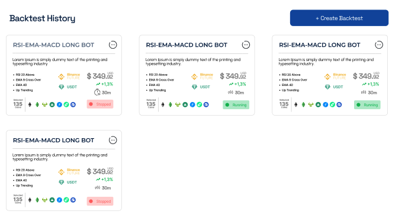

Sayfada infinity-scroll ile backtestler yüklenecek.

Kutu içindeki sağ-üst alanda yer alan butona basıldığı zaman
- Start Test - Stop Test
- Detail
- Delete butonuna basıldığı zaman popup açılacak. Mesaj olarak ***Bu testi silmek istediğinize emin misiniz?*** çıkacak. Ok ve Cancel butonları olacak. Seçime göre ilgili testi silecek veya iptal edecek.

## Create Backtest
Create Bot'un aynısı olacak. 
Test oluşturulduktan sonra eğer işlem başarılı ise işlem başarılı diye uyarı verilecek ve backtest listesine yönlendirilecek. Eğer işlem başarısız ise aynı sayfada kalacak.

## Backtest Detail
### Tablo halinde listelenecek.
- Rank : Veritabanında gelen Id değeri olacak
- Coin Name : İşlem yapan coin adı
- Entry Price : İşleme girdiği fiyat
- Close Price : İşlemden çıktığı fiyat
- Profit : İşlemden elde ettğiğ kar/zarar oranı
- Pozisyon : LONG veya SHORT

# Güncellenecek Alanlar
- Create Strategy sayfasına **Order Signal** yazan kısmı **Side** olacak
- Create Bot sayfasında Formation pasif hale getirilecek